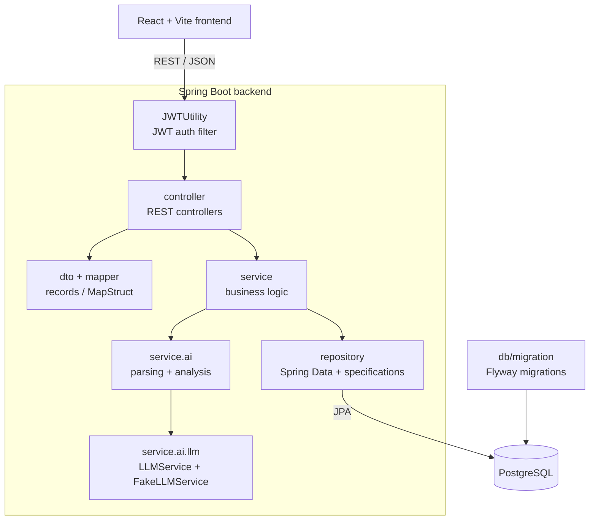

# JobMatch

[](https://github.com/adriangarciao/JobMatch/actions/workflows/maven.yml)

A full-stack Spring Boot + React app that scores how well a resume matches a job posting. Scoring is deterministic: a weighted skill- and text-overlap engine with no external LLM, so results are instant, reproducible, and free to run.

**Live demo:** https://adriangarciao-jobmatch.vercel.app

**Interactive API docs (Swagger UI):** https://job-match.up.railway.app/swagger-ui.html. Browse every endpoint, then run the full register, login, Authorize, and call-a-protected-route flow right in the browser.


More screenshots in [`frontend/public/images`](frontend/public/images).

## Features

**Web app (no sign-in):**
- Resume vs. job analysis (`POST /api/ai/analyze`): 0–100 match score, matched/missing core skills, and improvement suggestions
- Resume import: paste text, a `.txt`/`.md` file, or a PDF (parsed in-browser with `pdfjs-dist`, server-side fallback)
- Best-effort extraction of location and compensation from the posting
- Context-aware skill matching (e.g. `golang` is a skill; plain `go` is treated as the verb)

**Authenticated API** (not yet surfaced in the demo UI):
- Resume management: upload, store, list, download, delete (server-side extraction via Tika / PDFBox / POI)
- Application tracking: create, update, paged list, search/filter, delete with status management
- Auth: JWT access tokens with rotating refresh tokens in an HttpOnly cookie

## Tech Stack

**Backend:** Java 21 · Spring Boot 3.5.6 (Web, Data JPA, Security, Validation) · PostgreSQL · Flyway · JWT (jjwt) · MapStruct + Lombok · Tika / PDFBox / POI

**Frontend:** React 19 · Vite · `pdfjs-dist`

## Architecture



## Engineering Decisions

- **Scoring sits behind an `LLMService` interface.** The matcher (`FakeLLMService`) computes scores from weighted overlap rather than calling a model, which keeps it predictable, instant, free, and fully unit-testable. A model-backed implementation can replace it without touching controllers or the frontend.
- **JWT access tokens with rotating refresh tokens.** Access tokens are short-lived to limit exposure; refresh tokens rotate on use and live in an HttpOnly cookie to keep them out of JavaScript.
- **PDF parsing in the browser, with a server fallback.** `pdfjs-dist` extracts resume text client-side to keep requests light, and the backend (Tika/PDFBox/POI) covers formats the browser can't handle.
- **Flyway-managed schema.** Versioned SQL migrations keep the database reproducible instead of relying on Hibernate auto-DDL.
- **DTOs and MapStruct instead of exposing entities.** Records define the API contract and MapStruct maps them at compile time, decoupling the wire format from JPA entities.

## How matching works

The engine parses both inputs into core technical skills, then scores:

- **70%** core-skill overlap (from required + nice-to-have skills)
- **30%** general text-token overlap (capped at 60)

From that it derives the match score, matched/missing skills, and suggestions, plus best-effort job metadata (location, compensation).

## Getting Started

**Prerequisites:** Java 21 · PostgreSQL 17+ on port 5432 · Node.js 18+ · Maven 3.9+ (or the included wrapper)

**1. Database.** Create the schema (the backend runs Flyway migrations on startup):
```sql
CREATE DATABASE jobassistant;
```
The datasource reads `PGHOST`, `PGPORT`, `PGDATABASE`, `PGUSER`, `PGPASSWORD` (defaults `localhost:5432/jobassistant`, user `postgres`). A `JWT_SECRET` is required to start the backend. See `src/main/resources/application.properties`.

**2. Backend.** Starts on `http://localhost:8080`; Swagger UI is then at `http://localhost:8080/swagger-ui.html`:
```bash
./mvnw spring-boot:run        # Windows: .\mvnw.cmd spring-boot:run
```

**3. Frontend.** Starts on `http://localhost:5173`; set `VITE_API_URL` to the backend URL:
```bash
cd frontend && npm install && npm run dev
```

**Tests.** 85 unit + integration tests against in-memory H2, run on every push/PR via GitHub Actions. JaCoCo writes coverage to `target/site/jacoco/index.html`:
```bash
./mvnw clean test             # Windows: .\mvnw.cmd clean test
```

## API Reference

The interactive [Swagger UI](https://job-match.up.railway.app/swagger-ui.html) is the source of truth (schemas are generated from the DTOs and Jakarta validation). Summary:

**Analysis (public):** `POST /api/ai/analyze`

**Auth (public):** `POST /api/auth/{register,login,refresh,logout}` · `GET /api/auth/verify`

**Resumes (auth):** `POST /api/resumes` (multipart) · `POST /api/resumes/parse` · `GET /api/resumes` · `GET /api/resumes/{id}` · `GET /api/resumes/{id}/download` · `DELETE /api/resumes/{id}`

**Applications (auth):** `POST /api/applications` · `GET /api/applications/{id}` · `GET /api/applications/me/paged` · `GET /api/applications/me/search` · `PUT|PATCH /api/applications/{id}` · `DELETE /api/applications/{id}`

**Users (auth):** `GET /api/me` · `GET|PUT|PATCH /api/users/me` · `PUT /api/users/me/password` · admin user management under `/api/users`

## License

Released under the [MIT License](LICENSE).

## Contact

Adrian Garcia ([@adriangarciao](https://github.com/adriangarciao))
